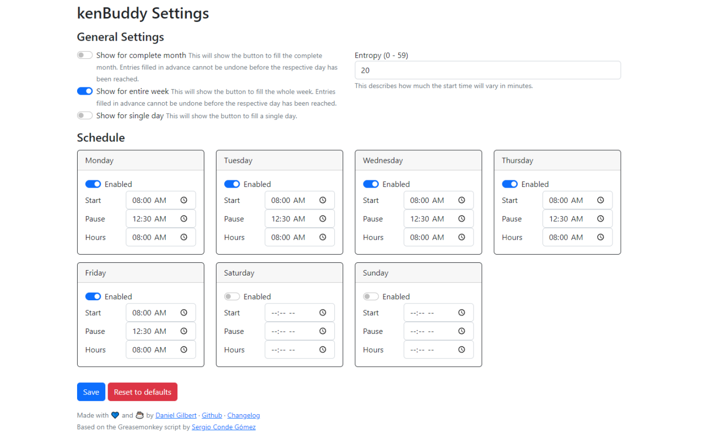

# kenBuddy - Browser extension

This extension allows to fill the attendance sheet provided at kenjo.io in a much easier manner. If the real attendance is not important, and you are just filling this sheet for legal purpose - this extension is for you. It comes with an entropy and a small options page.

For this extension to work, the "Attendance" widget needs to be visible on the home screen.

## Stores
- [Google Chrome & Opera][google-store]
- [Mozilla Firefox][firefox-store]

## Settings

### General Settings
- **Show for complete month** - this will show you the button for the complete month. Keep in mind that you won't be able to change the prefilled values until the respective day has been reached.
- **Show for entire week** - same as above, but just for the current week.
- **Show for single day** - shows the button to fill the attendance for just this day.

- **Entropy** - you can alternate the starting time. The entropy marks the maximum amount of minutes that will be added to the start time. If you don't want to have anything of that happening, just set it to 0.

### Schedule
- **Start** - set the time you usually start working.
- **Pause** - your usual pause duration.
- **Hours** - the amount of hours you work on this day.

## FAQ
- **I cannot see the button?**
    - Make sure to add the attendance widget to your Home Screen
- **I still cannot see the button!**
    - Press _"Refresh"_ or <kbd>F5</kbd> - mostly, this appears after you've navigated inside the kenjo web app, and return back to the Home screen.

[google-store]: https://chrome.google.com/webstore/detail/kenone/fdalhlmgbllklibldlbglgnomghicmhm
[firefox-store]: https://addons.mozilla.org/de/firefox/addon/kenbuddy/
